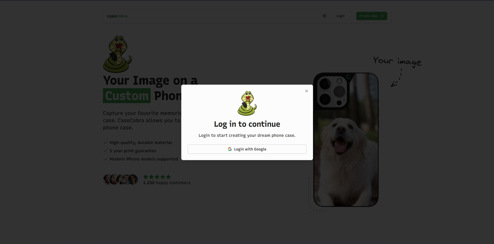
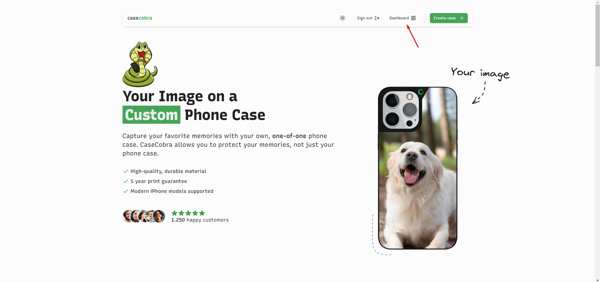

<a name="readme-top"></a>


<!-- PROJECT LOGO -->
<br />
<div align="center">
  

  <h3 align="center">CaseCobra</h3>

  <p align="center">
    Capture your favorite memories with your own phone case.
    <br />
    <br />
    <a href="https://case-cobra-kappa.vercel.app">View Demo</a>
  </p>
</div>


<!-- TABLE OF CONTENTS -->
<details>
  <summary>Table of Contents</summary>
  <ol>
    <li>
      <a href="#about-the-project">About The Project</a>
      <ul>
        <li><a href="#built-with">Built With</a></li>
      </ul>
    </li>
    <li>
      <a href="#getting-started">Getting Started</a>
      <ul>
        <li><a href="#prerequisites">Prerequisites</a></li>
        <li><a href="#installation">Installation</a></li>
      </ul>
    </li>
    <li><a href="#usage">Usage</a></li>
    <li><a href="#acknowledgments">Acknowledgments</a></li>
  </ol>
</details>


<!-- ABOUT THE PROJECT -->
## About The Project


Enhance your mobile experience with high-quality phone cases created by **CaseCobra**. Your phone will be embraced by the custom made phone cases made by you and surely feel your love :heart:. 

Here's why:
* High-quality, durable material
* 5 year print guarantee
* Modern iPhone models supported

<p align="right">(<a href="#readme-top">back to top</a>)</p>


### Built With

* [![Next][Next.js]][Next-url]
* [![Supabase][supabase]][supabase-url]
* [![Stripe][stripe]][stripe-url]
* [![React Query][react-query]][react-query-url]
* [![Shadcn/ui][shadcn]][shadcn-url]
* [![Tailwind Css][tailwind]][tailwind-url]

<p align="right">(<a href="#readme-top">back to top</a>)</p>


<!-- GETTING STARTED -->
## Getting Started

### Prerequisites

This is an example of how to list things you need to use the software and how to install them.
* npm
  ```sh
  npm install npm@latest -g
  ```
* pnpm
  ```sh
  npm install -g pnpm
  ```

### Installation

_Below is an example of how you can instruct your audience on installing and setting up your app. This template doesn't rely on any external dependencies or services._

1. Create a ``.env`` file inside ``apps/web`` and fill with necessary variables based on ``.env.example``
2. Clone the repo
   ```sh
   git clone https://github.com/yarkincaner/case-cobra.git
   ```
3. Install NPM packages with pnpm
   ```sh
   pnpm install
   ```
4. Run developer server
   ```sh
   pnpm dev
   ```

<p align="right">(<a href="#readme-top">back to top</a>)</p>


<!-- USAGE EXAMPLES -->
## Usage


### Landing Page
CaseCobra welcomes you with a landing page that contains a hero section, testimonials, and reviews.


You can use both light theme and dark theme to meet your preference.


### Login

Login page has two different appearance, one is a dialog with a route, and the other is a direct path. Having different login pages increases the user experience.



### Create Case

You can create your in three steps:
* **Upload** your image
* **Design** your case with uploaded image
* **Review** your configurated case

#### Create Case - Upload

A user can upload images via drag and drop or click to select an image to upload. This process takes a bit of time and user gets feedback with a progress bar to see how long will it take to upload their image, thus experience decent user experience.


#### Create Case - Design

In this step, user views uploaded image on a digital case and can replace or resize their image on the case. They can select desired configurations on the side panel that contains supported colors, iPhone models, materials, and finishes.


#### Create Case - Preview

In this last step, a preview of their configurated case shown to the user, the availability of shipment, highlights and materials, and total price that is base price plus configurations.


### Payment

CaseCobra has an integrated payment system with Stripe.


In order to test payment system, you can use a test card shown below that is provided by stripe to simulate a payment process


### Thank You Page

After payment is success, stripe redirects users to a thank you page with order informations.


### Admin

A dashboard button appears on navbar to navigate admin to dashboard.



Admin dashboard contains weekly and monthly goals, incoming orders from last week and details about these orders.


Admin can change status of an order.


<p align="right">(<a href="#readme-top">back to top</a>)</p>


<!-- ACKNOWLEDGMENTS -->
## Acknowledgments

* [Josh tried coding](https://www.youtube.com/watch?v=SG82Aqcaaa0)
* [Headless UI](https://headlessui.com)
* [Lucide icons](https://lucide.dev/)
* [React rnd](https://github.com/bokuweb/react-rnd)

<p align="right">(<a href="#readme-top">back to top</a>)</p>


[Next.js]: https://img.shields.io/badge/next.js-000000?style=for-the-badge&logo=nextdotjs&logoColor=white
[Next-url]: https://nextjs.org/
[supabase]: https://img.shields.io/badge/Supabase-181818?style=for-the-badge&logo=supabase&logoColor=white
[supabase-url]: https://supabase.com/
[shadcn]: https://img.shields.io/badge/shadcn%2Fui-000000?style=for-the-badge&logo=shadcnui&logoColor=white
[shadcn-url]: https://ui.shadcn.com/
[tailwind]: https://img.shields.io/badge/Tailwind_CSS-38B2AC?style=for-the-badge&logo=tailwind-css&logoColor=white
[tailwind-url]: https://tailwindcss.com/
[react-query]: https://img.shields.io/badge/React_Query-FF4154?style=for-the-badge&logo=ReactQuery&logoColor=white
[react-query-url]: https://tanstack.com/query/latest
[stripe]: https://img.shields.io/badge/Stripe-626CD9?style=for-the-badge&logo=Stripe&logoColor=white
[stripe-url]: https://stripe.com/